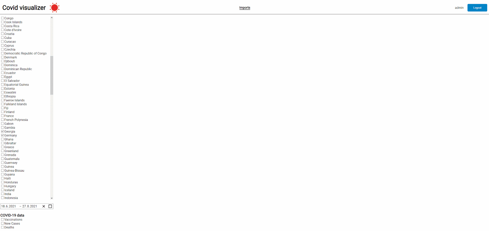
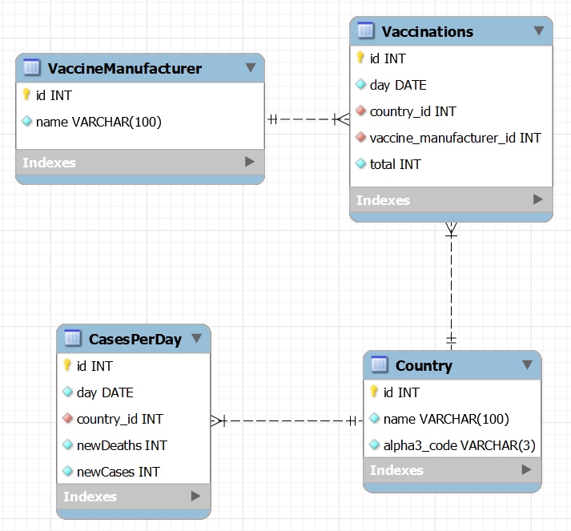

<div align="center">

<picture>
    <source  media="(prefers-color-scheme: light)" srcset="./assets/logo-dark.svg">
    
</picture>

---

[Launching](#launching-with-docker) • [Requirements](#requirements) • [Database shcema](#database-schema)

</div>

**Project subject**: Compilation of global statistical data regarding the pandemic

## Showcase



## Launching with Docker

-   Run:

```
docker compose up
```

## Launching without Docker

### server

-   Install maven dependencies
-   Run:

```
docker compose -f "db-compose.yml" up
```

-   Launch spring app with `dev` profile

### client

-   Run:

```
npm i
npm run dev
```

## After launching

-   Register as admin
-   Import Cases and/or Vaccinations from CSV

## Requirements

### Mandatory

-   Database ✔️
-   Network communication ✔️
-   Handling of XML & JSON files ✔️
-   Sign up, sign in & authorization of JWT ✔️
-   Unit/Integration tests ✔️

### Optional

-   Lombok ✔️
-   Gson/Xmappr/JAXB ❌(used Jackson)
-   Spring Boot ✔️
-   SQL ✔️
-   Docker ✔️
-   Android app ❌
-   Postman ✔️
-   Git ✔️

## Used data

Data as of 2023-05-25

-   [Cases and deaths (by country and date)](https://github.com/owid/covid-19-data/blob/master/public/data/cases_deaths/full_data.csv)
-   [Total vaccinations (by country, date and manufacturer)](https://github.com/owid/covid-19-data/blob/master/public/data/vaccinations/vaccinations-by-manufacturer.csv)
-   [Details about vaccinations (by country and date)](https://github.com/owid/covid-19-data/blob/master/public/data/vaccinations/vaccinations.csv)

## Database schema



---

### Used technologies

[](https://spring.io)
[](https://www.java.com)
[](https://react.dev)
[](https://vitejs.dev/)
[](https://www.mysql.com)
[](https://www.docker.com)
