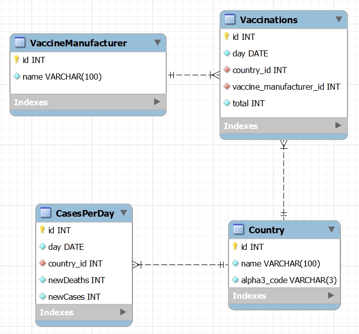

# Systems Integration: Project

**Temat**: Zestawienie różnych globalnych danych statystycznych dotyczących pandemii, porównanie zachorowań i śmiertelności przed i po rozpoczęciu szczepień

## Jak uruchomić?

### Serwer

1. Zpullować projekt
2. Uruchomić `composer install`
3. Skopiować .env.example, zmienić nazwę na .env i wprowadzić brakujące dane
4. Uruchomić `php artisan key:generate`
5. Uruchomić `php artisan migrate`
6. Uruchomić `php artisan serve`

### Klient

1. Zpullować projekt
2. Uruchomić `npm i`
3. Uruchomić `npm run dev`

## Wymagania

-   eksport/import z pliku XML – 5 pkt
-   eksport/import z pliku JSON/YAML – 5 pkt
-   eksport/import z bazy danych – 5 pkt
-   wykorzystanie ORM w celu dostępu do bazy danych– 5 pkt
-   wykorzystanie usług typu SOAP – 5 pkt
    -   Należy wysyłać dane, nie wystarczy odebranie samych informacji
-   wykorzystanie usług typu REST – 5 pkt
-   wykorzystanie kontenerów Docker – 5 pkt
-   wykorzystanie mechanizmów uwierzytelnienia i autoryzacji przy użyciu tokenów JWT – 5 pkt
    -   autoryzacja 2.5 pkt
    -   uzyskanie tokena 2.5 pkt
-   wykorzystanie poziomów izolacji w bazie danych – 5 pkt
    -   2 transakcje z różnymi poziomami izolacji

## Wykorzystywane dane

-   [Przypadki i śmiertelność (według kraju i daty)](https://github.com/owid/covid-19-data/blob/master/public/data/cases_deaths/full_data.csv)
-   [Całkowite szczepienia (według kraju, daty i producenta)](https://github.com/owid/covid-19-data/blob/master/public/data/vaccinations/vaccinations-by-manufacturer.csv)
-   [Szczegóły dotyczące szczepień (według kraju i daty)](https://github.com/owid/covid-19-data/blob/master/public/data/vaccinations/vaccinations.csv)

## Dokumentacja

[Notowanie na bieżąco (według sugestii Głuchowskiego)](https://docs.google.com/document/d/1nVufnYzmMOklFIl-ZViPHp18eebJxU9x0i108niPMXA/edit?usp=sharing)

